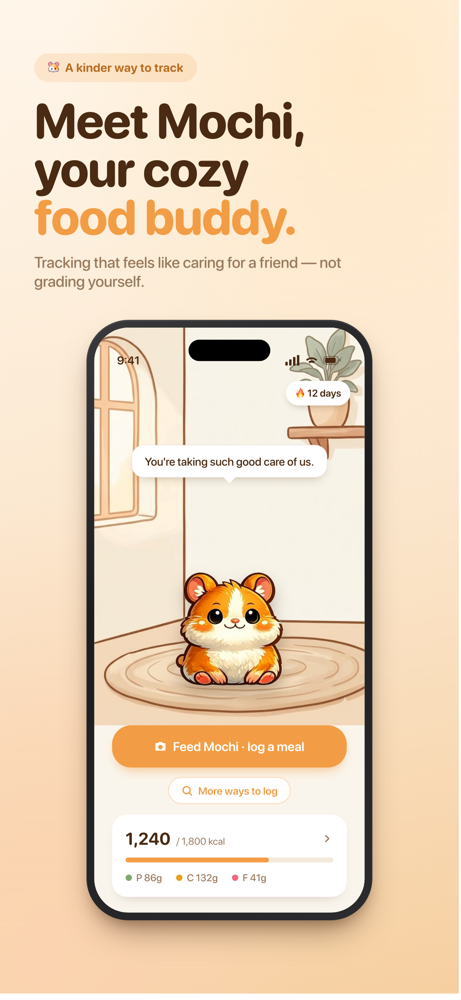
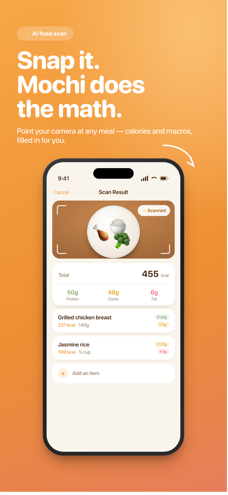
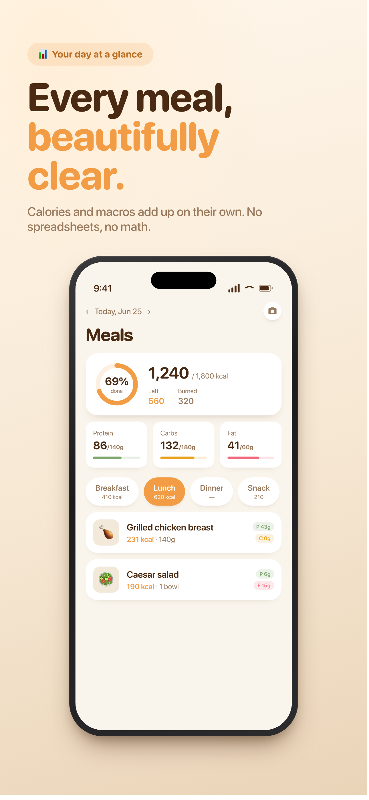
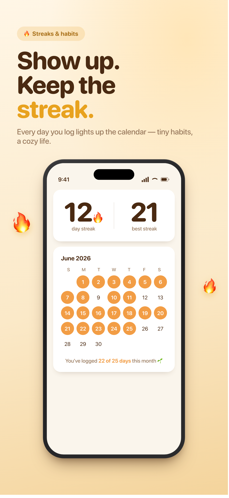

# Mochi

A cozy iOS calorie and macro tracker built around a hamster named Mochi. Mochi reacts to whether you log, not to what you ate. No calorie shaming, no guilt, no streak threats.

Snap a photo of your plate and an AI fills in the calories and macros. Search a food database or add meals by hand. Mochi lives in a small habitat that shifts from day to night and responds when you stop by.

<p align="center">
  
  
  
  
</p>

## Features

- AI food scan: photograph a meal and get per-item calories and macros, editable before you save.
- Food database search with branded products, plus manual and custom entries.
- Daily calorie and macro totals across breakfast, lunch, dinner, and snacks.
- Weight logging with a simple trend graph.
- Logging streaks and a month calendar.
- Workout plans and a daily journal.
- Apple Health: reads active calories burned and body weight (optional).
- One gentle reminder per day (optional).
- Premium subscription (StoreKit 2) for unlimited scans. Manual logging and search stay free.

## Design principles

Mochi's moods are tied to engagement only. Logging, opening the app, and keeping a streak make him happy. Nothing he says or shows judges food choices, calorie totals, weight, or a missed goal. A sad state reads as "Mochi missed you," never disappointment.

All styling goes through `MochiTheme` tokens (a warm cream and orange palette, SF Rounded type, fixed radii and spacing). Animation constants live in `MochiMotion`. Views never hardcode colors, fonts, or image names.

## Tech stack

- SwiftUI with SwiftData for local persistence (food entries, weight, journal, workouts)
- StoreKit 2 for subscriptions
- HealthKit for burned calories and body weight
- Anthropic for the food scan and Edamam for the food database, both reached through a Cloudflare Worker proxy so no API keys ship in the app
- GRDB for local food lookups
- iPhone only, iOS 26.4+, built with Xcode 26

## Project structure

```
EasyFit/
  App/          App entry, MochiTheme design tokens, root navigation
  Mochi/        Character: states, dialogue, motion, asset provider
  Models/       SwiftData models (FoodEntry, BodyWeightEntry, JournalEntry, WorkoutPlan, Exercise)
  Services/     Food scan, food search, HealthKit, StoreKit (PremiumStore), notifications, scan quota
  ViewModels/   Nutrition, progress, workout, Mochi
  Views/        Nutrition, Log, Journal, Progress, Workout, Profile, Paywall, Onboarding, Mochi, Components
proxy/          Cloudflare Worker that holds the API keys
marketing/      App Store screenshots and the render pipeline
```

The Xcode project and folders are still named `EasyFit` from before the rename. The shipping app is Mochi, bundle id `com.hanryli.Mochi`.

## Getting started

Requirements: Xcode 26 or later, and an iOS 26.4 device or simulator.

1. Clone the repo and open `EasyFit.xcodeproj`.
2. Create `EasyFit/Config.xcconfig` (gitignored) and set the proxy URL:
   ```
   PROXY_BASE_URL = https:/$()/mochi-proxy.<you>.workers.dev
   ```
   The `/$()/` keeps xcconfig from treating `//` as a comment. With no proxy URL set, the food scan falls back to mock data, so search and manual entry still work for local testing.
3. Build and run the `EasyFit` scheme on an iPhone.

## API proxy

The app never holds the Anthropic or Edamam keys. They live as secrets in the Cloudflare Worker under `proxy/`, which exposes two endpoints:

- `POST /scan` forwards an Anthropic Messages request for the food scan.
- `GET /foods?ingr=<query>` forwards an Edamam food search.

Deploy steps are in [proxy/README.md](proxy/README.md). The proxy is thin and unauthenticated, which is fine for TestFlight. Add App Attest or DeviceCheck plus rate limiting before a public launch.

## Privacy

Your logs stay on the device (SwiftData). There is no account and no login. Network requests go to the proxy for scans and food search, and to Apple Health if you grant access. Full policy: https://hanries.github.io/Mochi/privacy-policy.html

## License

Personal project. No open-source license yet, so please ask before reusing the code or the Mochi artwork.
